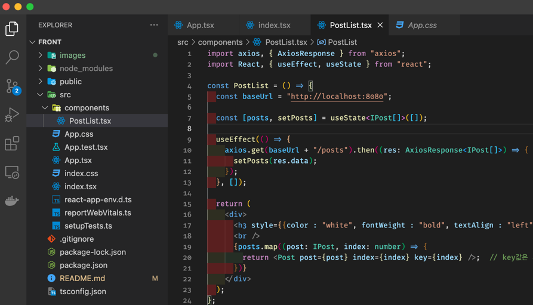

koorungblog 리액트 프로젝트
==
 

리액트 - 타입스크립트를 이용하여 프론트단 구성 연습

* Tool : Visual Studio Code

* Dependency

  * axios : ajax 편의 기능
  * bootstrap : 부트스트랩
  * react-bootstrap : 리액트용 부트스트랩 컴포넌트
  
`백앤드가 주력`이고 복습을 겸해서 하는 것이기 때문에 천천히 진행될 예정... 아마도?

> since. 2022. 10. 25.